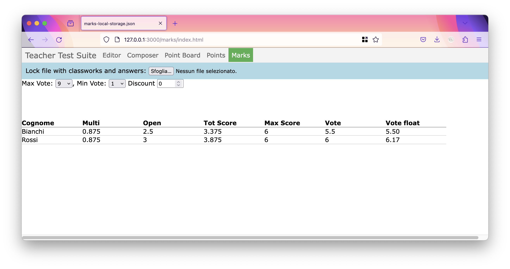

# Teacher suite for tests

This suite contains tools for teacher to create tests for high-school students.

At the moment the suite creates quizzes (multiple choice closed-ended) and open questions (answer as paragraph). Each student will have a slightly different test, to avoid copying between students. This suite promotes a non-linear evaluation of student, e.g. not a single sortable value but more axes to better understand students performances.

This suite mainly tackle the following needs.

**Need**: easy to print classwork, to make the test also on paper, without a device for each student; the classwork have also to be automatically checked after manual insertion of the student answer in the system.

**Need**: most of other test software evaluated in a single linear scale, eg. A-F, 0-10, etc. This evaluation doesn't reflect the real complexity of student situation. This suite will create a multi-axis, star profile for each student.

**Need**: facilitate test creation, measurement and evaluation for SEN (special educational needs) student. This suite can create different tests according to diagnosis, assign different points and help in the evaluation phase.

## Objectives

- [X] support multiple choice questions and open answers questions with evaluation grid
- [ ] propose tips to create good multiple answers
- [X] easy to print
- [X] integrable with other tools (es. Classroom)
- [X] create a different test for each student of the class, according to the student needs
- [X] support specific learning disabilities, removing questions according to student disability or extending the maximum time
- [ ] create a profile of the student with strengths and weaknesses, to help the teacher developing effective strategies both for students and for the whole class
- [ ] provide statistics both for single questions and students, with tips for the teacher to improve the future classwork

Not all the above feature are currently implemented, but work is in progress and continuously updated.

## Screenshots

PDF created by the above example is [here](screenshots/example.pdf).

## How to use

The application has to be used as a flow starting from the first item in the menù (Editor) and going on the right (Composer, Point Board, etc.).

### Editor

At the moment is work in progress. To create a classwork, please create a new file in `src/api/classwork/` folder. User [`classwork-example.yaml`](src/api/classworks/classwork-example.yaml) as template.

Create also the list of students on `src/api/students/` folder. Again, use [`students-example.json`](src/api/students/students-example.json) as template.

Please note that email address is used for:

- unique id
- to generate the random seed to deterministically shuffle questions
- to eventually connect with other external services (ex. Google Classroom)

Update also [classworks.json](src/api/classworks.json) and [`students.json`](src/api/students.json) files with the new files you just created. Only the item listed inside these file are shown inside the application.

### Composer

1. Select students and classworks on the top menu
1. Click on create classwork
1. If everything is fine, you can go to your browser menu and print the page, or just click `ctrl-P`
1. Remember to **click on the save lock file** before moving to the next tab

### Point-board

Use the text input on the left of each student to insert the answers to the multiple choice questions.

The text input is designed to be easily used with a single hand, so it use numbers instead of letters, as following:

- input 1 for A answer
- input 2 for B answer
- input 3 for C answer
- etc...
- input 0 for omitted answer

Use the moons to insert points for open questions. A black moon is 0, an half moon is 0.5, a full yellow moon is 1 point. For answer with more than one point, you can click on the last moon to fulfill all the moons.

Remember to **click on the save button** before moving to the next tab.

### Points

Here are listed all the students with their points.

You can print this page and you have a few options:

- split page when printing: each student is printed in a different page
- rotate solution when printing: the points are rotate of 180 degree, to be easily printed on the bottom of the page (instead of the top)

Remember to **click on the save button** before moving to the next tab.

### Marks

In this tab, you can scale the points into a mark scale, for example from 0 to 10.

Set the min and max vote according to your need.

You can use DSA points discount to reduce the max score value, for example if you want that the student can take the maximum mark also if he didn't answered correctly to 100% of the answer.

## Quick start for developers

This page can be run in two flavors:

1. just launch a web server on src/ (most of the features are available, except connection with database)
2. run a `docker-compose up`.
