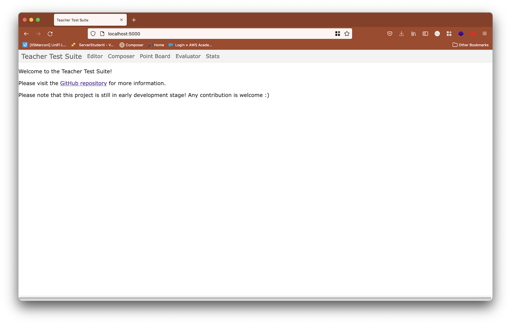
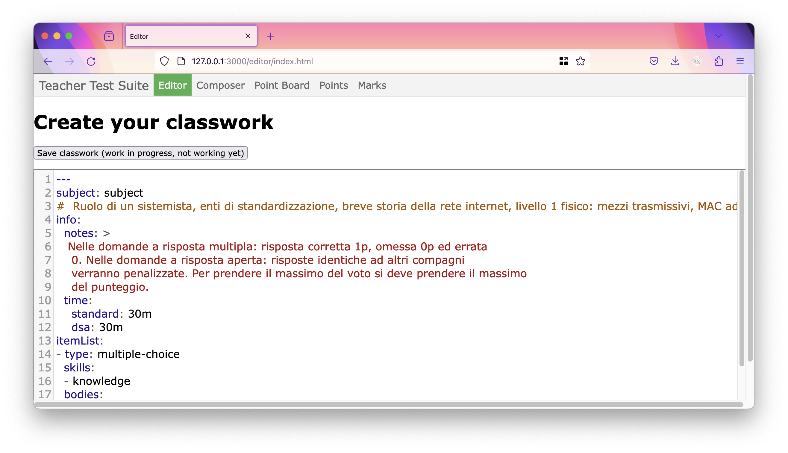
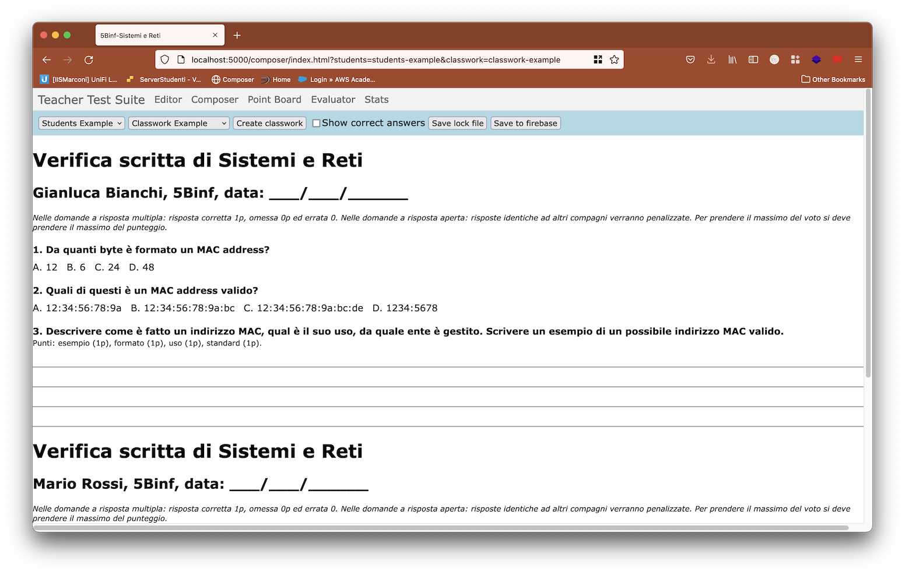
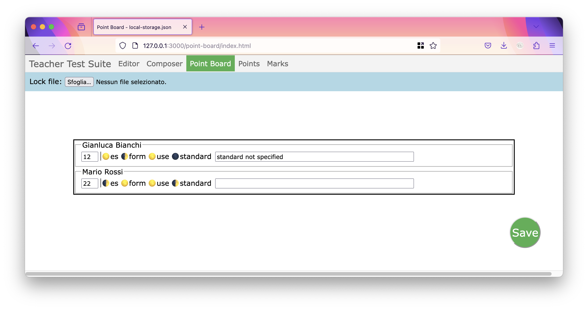
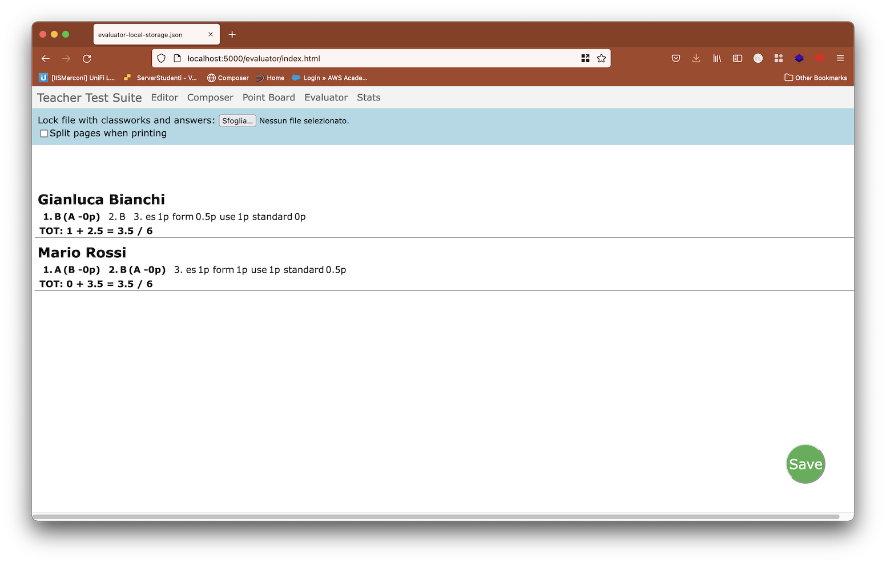

# Teacher suite for tests
This suite contains tools for teacher to create tests for high-school students.

At the moment the suite creates quizzes (multiple choice closed-ended) and open questions (answer as paragraph). Each student will have a slighty different test, to avoid copying between students. This suite promotes a non-linear evaluation of student, e.g. not a single sortable value but more axes to better understand students performances.

This suite tackle on two main problems.

**Problem 1**: most of test are evaluated in a single linear scale, eg. A-F, 0-10, etc. This evaluation doesn't reflect the real complexity of student situation. This suite will create a multi-axis, star profile for each student.

**Problem 2**: facilitate test creation, mesaurement and evaluation for SEN (special educational needs) student. This suite can create different tests according to diagnosis, assign different points and help in the evaluation phase.

## Objectives
- [X] support multiple choice questions and open answers questions with evaluation grid
- [] propose tips to create good multiple answers
- [X] easy to print
- [X] integrable with other tools (es. Classroom)
- [X] create a different test for each student of the class, according to the student needs
- [X] support specific learning disabilities, removing questions according to student disability or extending the maximum time
- [] create a profile of the student with strengths and weaknesses, to help the teacher developing effective strategies both for students and for the whole class
- [] provide statistics both for single questions and students, with tips for the teacher to improve the future classwork

Not all the above feature are currently implemented, but work is in progress and continuously updated.

# Screenshots

# Quick start (for developers)
This project uses Docker and Docker Compose. Just run a `docker-compose up` to get started.

Update [students](src/api/students/students-example.json) and [classworks](src/api/classworks/classwork-example.yaml) according to your needs.

Update also [this](src/api/students.json) and [this](src/api/classworks.json) files if needed, to match you file names.

